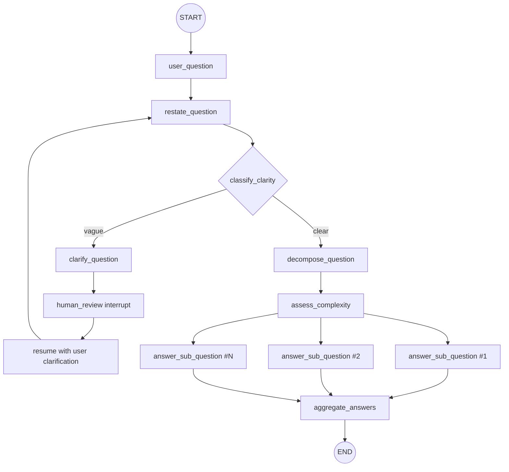

# Thinking Machine

Conversational reasoning agent built with LangGraph. It accepts a raw text question from a user and routes it through a visible, structured reasoning workflow before producing a final answer. The agent is designed to never jump straight to the answer: every question must pass through restatement, clarity checking, decomposition, complexity assessment, sub-question reasoning, and final synthesis.

## What This Project Is

This draft implements a node-based reasoning pipeline for questions that require explicit intermediate thinking. The agent first restates the user's question in its own words to confirm what it understood, then decides whether the question is clear enough to reason through or too vague to answer responsibly.

If the question is vague, the agent generates exactly one focused clarifying question, surfaces it to the user, and pauses. When the user responds, the agent resumes the same reasoning workflow with the enriched input instead of discarding the prior context or jumping directly to the answer.

If the question is clear, the agent decomposes it into the smallest set of sub-questions needed to fully answer it, assesses the overall complexity of the request, works through each sub-question individually, and synthesizes the sub-answers into one coherent final response.

The steps are:
- Raw question intake
- Restatement of user intent
- Clarity assessment (clear vs vague)
- Exactly one clarifying question when clarification is needed
- Human-in-the-loop pause/resume for clarification
- Question decomposition into the smallest necessary sub-question set
- Complexity assessment (low/medium/high)
- Reasoned answers for each sub-question
- Final synthesis

## Architecture

Core files:
- `agent.py`: Graph construction and node registration
- `nodes.py`: Node logic and routing behavior
- `state.py`: Shared graph state schema
- `navigator_llm.py`: LLM wrapper used by all reasoning nodes
- `main.py`: CLI entrypoint with interrupt/resume loop

### Flow Diagram




## Implementation Notes (Current Draft)

- Uses `Command(goto=...)`-based dynamic routing between nodes.
- Uses `interrupt(...)` in `human_review_node` to pause execution and collect one user clarification response.
- Uses `MemorySaver` checkpointing with a thread id in `main.py` to support pause/resume in one CLI session.
- Uses LangGraph API's built-in persistence when running with `langgraph dev`.
- Uses structured outputs for:
	- Clarity classification (`ClarityClassification`)
	- Complexity assessment (`ComplexityAssessment`)

## Setup

1. Create and activate a virtual environment.
2. Install dependencies:

```bash
pip install -r requirements.txt
```

3. Configure environment variables in `.env`:

```bash
# Navigator LLM credentials
NAVIGATOR_API_KEY=...
NAVIGATOR_API_ENDPOINT=...
NAVIGATOR_MODEL=...

# LangGraph Studio / LangSmith
LANGSMITH_API_KEY=...
```

The CLI path (`python main.py`) loads `.env` through `python-dotenv`. The LangGraph dev server loads the same file because `langgraph.json` contains `"env": ".env"`.

`LANGSMITH_API_KEY` is required for LangGraph Studio and LangSmith tracing.

## Run

```bash
python main.py
```

Behavior at runtime:
- Prompts for a question
- Runs graph invocation
- If interrupted for clarification, asks the generated clarifying question and resumes
- Prints the final graph result state

## Local Server Setup

Yes, you can host this agent as a local server! Use **`langgraph dev`** to run the agent as a REST API server without Docker, perfect for development and testing.

### Prerequisites

- LangSmith account
- LangSmith API key in `.env` as `LANGSMITH_API_KEY=...`
- `langgraph-cli[inmem]` installed (added to `requirements.txt`)

### Install LangGraph CLI

The CLI is already in `requirements.txt`. Install with your dependencies:

```bash
pip install -r requirements.txt
```

### Start the Local Server

Run the development server:

```bash
source .venv/bin/activate
langgraph dev
```

You'll see output like:

```
Ready!

- API: http://localhost:2024/
- Docs: http://localhost:2024/docs
- Studio Web UI: https://smith.langchain.com/studio/?baseUrl=http://127.0.0.1:2024
```

The server starts on **port 2024** by default. Visit `http://localhost:2024/docs` for interactive API documentation.

### Test via Python SDK

Install the SDK:

```bash
pip install langgraph-sdk
```

Send a question to your agent:

```python
from langgraph_sdk import get_sync_client

client = get_sync_client(url="http://localhost:2024")

# Stream a response
for chunk in client.runs.stream(
		None,  # Threadless run
		"thinking_machine",  # Assistant ID from langgraph.json
		input={
				"input_question": "What is the difference between a process and a thread?"
		},
		stream_mode="updates",
):
		print(f"Event: {chunk.event}")
		print(chunk.data)
		print("\n---\n")
```

### Test via REST API (cURL)

For interrupt/resume behavior, use a thread-backed run. A stream is expected to stop when the graph reaches `human_review_node`; the interrupt is the graph pausing for external input, not the server crashing.

Create a thread:

```bash
curl -s --request POST \
	--url "http://localhost:2024/threads" \
	--header 'Content-Type: application/json' \
	--data '{}'
```

Copy the returned `thread_id`, then start the run on that thread:

```bash
curl -s --request POST \
	--url "http://localhost:2024/threads/<THREAD_ID>/runs/wait" \
	--header 'Content-Type: application/json' \
	--data '{
		"assistant_id": "thinking_machine",
		"input": {
			"input_question": "How do I make it faster?"
		}
	}'
```

If the question is vague, the response includes `__interrupt__` with a `clarifying_question`. Resume the same thread with the user's clarification:

```bash
curl -s --request POST \
	--url "http://localhost:2024/threads/<THREAD_ID>/runs/wait" \
	--header 'Content-Type: application/json' \
	--data '{
		"assistant_id": "thinking_machine",
		"command": {
			"resume": "I mean how can I make this Python function run faster?"
		}
	}'
```

To stream the events instead of waiting for the full response, use the same thread path with `/runs/stream` for both the initial call and the resume call:

```bash
curl -s --request POST \
	--url "http://localhost:2024/threads/<THREAD_ID>/runs/stream" \
	--header 'Content-Type: application/json' \
	--data '{
		"assistant_id": "thinking_machine",
		"input": {
			"input_question": "How do I make it faster?"
		},
		"stream_mode": "updates"
	}'
```

```bash
curl -s --request POST \
	--url "http://localhost:2024/threads/<THREAD_ID>/runs/stream" \
	--header 'Content-Type: application/json' \
	--data '{
		"assistant_id": "thinking_machine",
		"command": {
			"resume": "I mean how can I make this Python function run faster?"
		},
		"stream_mode": "updates"
	}'
```

### Features

- **No Docker required**: Runs directly in your environment
- **Hot reloading**: Automatically reloads when you change code
- **In-memory state**: Persisted locally during development
- **Built-in debugging**: Attach IDE debugger for line-level breakpoints
- **Fast iteration**: Optimized for development speed


## Status

This is the 1st Draft.
