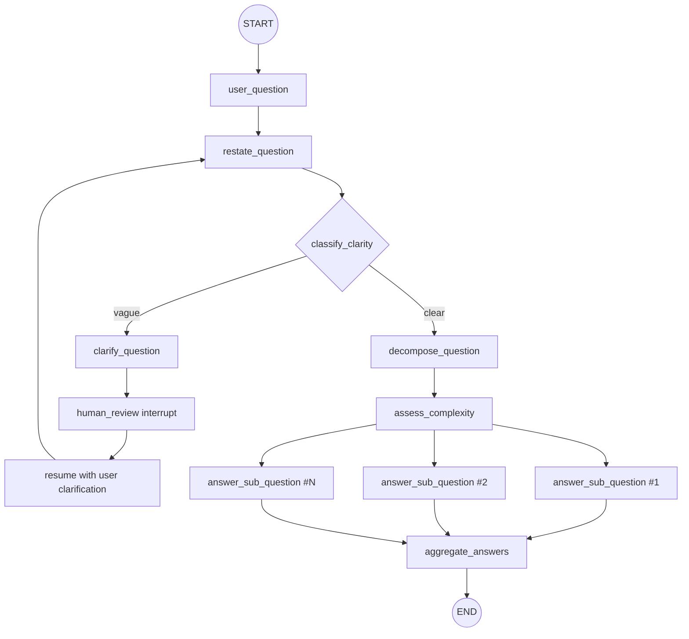

# Thinking Machine (Draft 1)

Conversational reasoning agent built with LangGraph. It takes a user question and routes it through a visible reasoning workflow before producing a final answer.

## What This Project Is

This draft implements a node-based reasoning pipeline:
- Input question capture
- Restatement of user intent
- Clarity classification (clear vs vague)
- Clarifying question generation when needed
- Human-in-the-loop pause/resume for clarification
- Question decomposition into sub-questions
- Complexity assessment (low/medium/high)
- Sub-question answering
- Final synthesis

## Architecture

Core files:
- `agent.py`: Graph construction and node registration
- `nodes.py`: Node logic and routing behavior
- `state.py`: Shared graph state schema
- `navigator_llm.py`: LLM wrapper used by all reasoning nodes
- `main.py`: CLI entrypoint with interrupt/resume loop

### Flow Diagram




## Implementation Notes (Current Draft)

- Uses `Command(goto=...)`-based dynamic routing between nodes.
- Uses `interrupt(...)` in `human_review_node` to pause execution and collect one user clarification response.
- Uses `MemorySaver` checkpointing with a thread id in `main.py` to support pause/resume in one session.
- Uses structured outputs for:
	- Clarity classification (`ClarityClassification`)
	- Complexity assessment (`ComplexityAssessment`)

## Setup

1. Create and activate a virtual environment.
2. Install dependencies:

```bash
pip install -r requirements.txt
```

3. Configure environment variables:

```bash
NAVIGATOR_API_KEY=...
NAVIGATOR_API_ENDPOINT=...
NAVIGATOR_MODEL=...
```

You can place these in a `.env` file (loaded via `python-dotenv`).

## Run

```bash
python main.py
```

Behavior at runtime:
- Prompts for a question
- Runs graph invocation
- If interrupted for clarification, asks the generated clarifying question and resumes
- Prints the final graph result state

## Local Server Setup

Yes, you can host this agent as a local server! Use **`langgraph dev`** to run the agent as a REST API server without Docker, perfect for development and testing.

### Prerequisites

- LangSmith account (free to sign up at https://smith.langchain.com)
- LangSmith API key (set as `LANGSMITH_API_KEY` environment variable)
- `langgraph-cli[inmem]` installed (added to `requirements.txt`)

### Install LangGraph CLI

The CLI is already in `requirements.txt`. Install with your dependencies:

```bash
pip install -r requirements.txt
```

### Start the Local Server

Run the development server:

```bash
langgraph dev
```

You'll see output like:

```
Ready!

- API: http://localhost:2024/
- Docs: http://localhost:2024/docs
- Studio Web UI: https://smith.langchain.com/studio/?baseUrl=http://127.0.0.1:2024
```

The server starts on **port 2024** by default. Visit `http://localhost:2024/docs` for interactive API documentation.

### Test via Python SDK

Install the SDK:

```bash
pip install langgraph-sdk
```

Send a question to your agent:

```python
from langgraph_sdk import get_sync_client

client = get_sync_client(url="http://localhost:2024")

# Stream a response
for chunk in client.runs.stream(
		None,  # Threadless run
		"thinking_machine",  # Assistant ID from langgraph.json
		input={
				"input_question": "What is the difference between a process and a thread?"
		},
		stream_mode="updates",
):
		print(f"Event: {chunk.event}")
		print(chunk.data)
		print("\n---\n")
```

### Test via REST API (cURL)

```bash
curl -s --request POST \
	--url "http://localhost:2024/runs/stream" \
	--header 'Content-Type: application/json' \
	--data '{
		"assistant_id": "thinking_machine",
		"input": {
			"input_question": "How do I make it faster?"
		},
		"stream_mode": "updates"
	}'
```

### Features

- **No Docker required**: Runs directly in your environment
- **Hot reloading**: Automatically reloads when you change code
- **In-memory state**: Persisted locally during development
- **Built-in debugging**: Attach IDE debugger for line-level breakpoints
- **Fast iteration**: Optimized for development speed

### Production-like Testing

When you're ready to validate against production behavior, use `langgraph up` (requires Docker):

```bash
langgraph up
```

This spins up PostgreSQL, Redis, and a production-like Agent Server stack on port 8123.

### Deploy to LangSmith Cloud or Self-Hosted

Once tested locally, deploy via the LangSmith UI or CLI:

```bash
langgraph deploy
```

For more details, see the [LangGraph Deployment guide](https://docs.langchain.com/oss/python/langgraph/deploy).

## Status

This is the 1st Draft.
